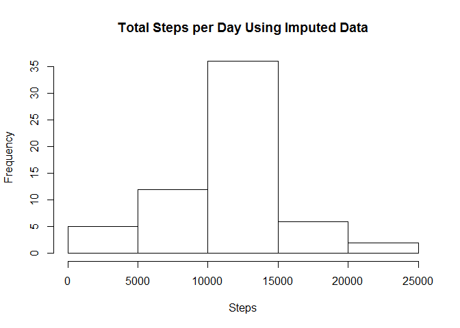
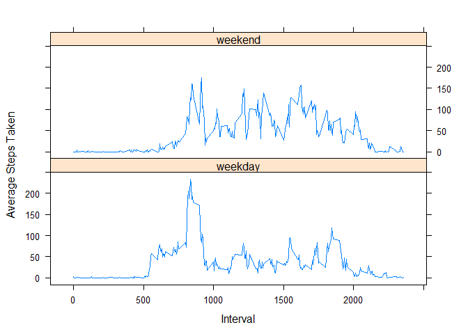

# Week 2 Assignment
Cindy Molitor  
June 9, 2017  


##Loading and preprocessing the data

Read in the activity file and convert the date from a factor variable to a date variable.


```r
activity <- read.csv("activity.csv")
activity$date <- as.Date(activity$date)
```

##What is mean total number of steps taken per day?

1. Calculate the total steps per day.


```r
step_totals <- setNames(aggregate(activity$steps,
                        by=list(activity$date), 
                        FUN=sum, na.rm=TRUE),
                        c("date","steps_per_day"))
```
  
2. Create a histogram of the total steps per day.


```r
hist(step_totals$steps_per_day, main="Total Steps per Day", xlab="Steps")
```

<!-- -->
  
3. Calculate the mean and median steps per day.


```r
mean(step_totals$steps_per_day, na.rm=TRUE)
```

```
## [1] 9354.23
```

```r
median(step_totals$steps_per_day, na.rm=TRUE)
```

```
## [1] 10395
```

##What is the average daily activity pattern?

1. Calculate the average number of steps per interval


```r
mean_int <- setNames(aggregate(activity$steps,
                     by=list(activity$interval),
                     FUN=mean, na.rm=TRUE),
                     c("interval","average_steps"))
```

2. Create a time series plot of the average number of steps per interval.


```r
with(mean_int, plot(interval, average_steps, type="l", ylab="Average Steps"))
```

<!-- -->

3. Find the interval with the greatest number of average steps.


```r
mean_int[which.max(mean_int$average_steps),]
```

```
##     interval average_steps
## 104      835      206.1698
```

##Imputing missing values

1. Get the total number of rows with NAs.


```r
sum(is.na(activity$steps))
```

```
## [1] 2304
```

2. Create a new dataset with the NA values replaced by the mean of the
interval from the mean_int dataframe created above.


```r
imputed_steps <- merge(activity, mean_int, by="interval", x.all=TRUE)
imputed_steps <- transform(imputed_steps,
                           steps = ifelse(is.na(steps), average_steps,                                                 steps))
```

3. Calculate the total steps per day using the imputed data.


```r
istep_totals <- setNames(aggregate(imputed_steps$steps,
                         by=list(imputed_steps$date), 
                         FUN=sum, na.rm=TRUE),
                         c("date","steps_per_day"))
```

4. Create a histogram of the total steps per day using the imputed data.


```r
hist(istep_totals$steps_per_day,
     main="Total Steps per Day Using Imputed Data", xlab="Steps")
```

<!-- -->

5. Calculate the mean and median steps per day using the imputed data.


```r
mean(istep_totals$steps_per_day, na.rm=TRUE)
```

```
## [1] 10766.19
```

```r
median(istep_totals$steps_per_day, na.rm=TRUE)
```

```
## [1] 10766.19
```

Using the mean of the intervals to impute the NA values appears to increase the values around the median, and gives the histogram a more normal shape.

##Are there differences in activity patterns between weekdays and weekends?

1. Add a factor variable that designates whether the day is a weekday or a weekend day.


```r
activity$dtype <- ifelse(weekdays(activity$date) %in% 
                         c("Saturday", "Sunday"),"weekend", "weekday")
activity$dtype <- as.factor(activity$dtype)
```

2. Calculate the average number of steps per interval per day type.


```r
dtype_int <- setNames(aggregate(activity$steps,
                      by=list(activity$dtype, activity$interval),
                      FUN=mean, na.rm=TRUE),
                      c("dtype","interval","average_steps"))
```

3. Create time series plots of the average number of steps per interval per day type. 


```r
library(lattice)
xyplot(average_steps ~ interval | dtype, type= "l", data=dtype_int,
       layout=c(1,2), xlab="Interval", ylab="Average Steps Taken")
```

<!-- -->
